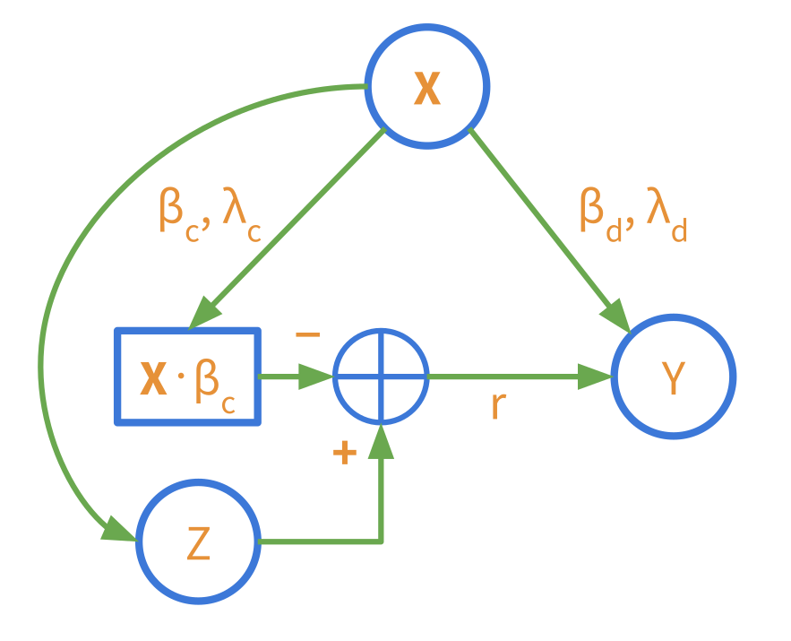

TwoStageRidge
=============

A simple implementation of the two-stage ridge regression model described in
Hahn et. al (2018) with a scikit-learn compatible API. This model allows us to
use many and potentially highly correlated control variables with observational
causal inference.

> Hahn, P.R., Carvalho, C.M., Puelz, D., He, J., 2018. Regularization and
> Confounding in Linear Regression for Treatment Effect Estimation. Bayesian
> Anal. 13. https://doi.org/10.1214/16-BA1044

We have implemented maximum a-posteriori models rather than the fully Bayesian
treatment of the regression weights as described in (Hahn et. al, 2018). The
model implemented is;

1. Selection model: Z = **X**β<sub>c</sub> + ε,
2. Response model: Y = α(Z - **X**β<sub>c</sub>) + **X**β<sub>d</sub> + ν.

Here **X**, Y and Z are random variables. **X** are the controls, Z is the
treatment, and Y is the outcome. β<sub>c</sub> are first stage the linear
regression weights, β<sub>d</sub> are the second stage linear regression
weights on the control variables. α is the average treatment effect (ATE), and
ε ~ N(0, σ<sup>2</sup><sub>ε</sub>), ν ~ N(0, σ<sup>2</sup><sub>ν</sub>).

We place *l*<sub>2</sub> regularizers on the regression weights in the
regression objective functions,

1. Selection model: λ<sub>c</sub>·||β<sub>c</sub>||<sup>2</sup><sub>2</sub>,
2. Response model: λ<sub>d</sub>·||β<sub>d</sub>||<sup>2</sup><sub>2</sub>.

No regularisation is applied to α. This formulation leads to a less biased
estimation of α over alternate ridge regression models. We can get an intuition
for this from the following graphical model,

<p align="center"></p>

Here round nodes with letters inside are random variables, square nodes are
deterministic functions, and ⊕ is addition/subtraction. Arrows denote the
direction of flow. This can be interpreted like a typical triangle graphical
model denoting the causal relationships **X** 🠖 Y, **X** 🠖 Z and Z 🠖 Y but 
with the addition of the stage 1 and 2 modelling influences from the
equations above. Here r = Z - **X**β<sub>c</sub>.

We can see that the influence of the control variables, **X**, on the
treatment, Z, has explicitly been removed when predicting Y on the path Z 🠖
Y. That is, only the "residual" signal from the treatment variables, r, that is
not explained by the control variables is allowed to influence Y through α.
This results in the estimation bias of α being a function of the residual r
(Equation 7; Hahn et. al 2018), instead of the treatments Z
(Equation 3; Hahn et. al 2018). Since r is close to zero (depending on the
strength of the regularisation) we end up with a low bias, but higher variance,
estimator of α. The estimator is higher variance since Var(α|r) = 
σ<sup>2</sup><sub>ν</sub> / (Σ<sub>i</sub> r<sup>2</sup><sub>i</sub>) instead 
of Var(α|Z) = 
σ<sup>2</sup><sub>ν</sub> / (Σ<sub>i</sub> z<sup>2</sup><sub>i</sub>).


Installation
------------

This repository can be directly installed from GitHub, e.g.

    $ pip install git+git://github.com/gradientinstitute/twostageridge.git#egg=twostageridge


Quick start
-----------

`TwoStageRidge` uses a scikit learn interface. In order to retain compatibility
with all of the pipelines and model selection tools we have to treat the inputs
to the model specially. That is, we have to concatenate the control variables,
`X` and the treatment variables `Z` into one input array, e.g. `W =
np.hstack((Z, X))`. For example,

```python
import numpy as np
from twostagerigde import TwoStageRidge

X, Y, Z = load_data()  # for some data function

# Where:
# - X.shape -> (N, D)
# - Y.shape -> (N,)
# - Z.shape -> (N,)

W = np.hstack((Z[:, np.newaxis], X))

ts = TwoStageRidge(treatment_index=0)  # Column index of the treatment variable
ts.fit(W, Y)  # estimate causal effect, alpha

print(ts.model_statistics())
```

This will print out the estimated average treatment effect, standard error,
t-statistic, p-value and degrees of freedom of a two-sided t-test against a null 
hypothesis of α = 0. For more information on how to use this model, and how to
perform model selection for the model parameters, see the [notebooks](notebooks).

Vector treatments, **Z**, can also be inferred. You just have to specify the
column indices of all treatment variables in `W`. For this you can use a numpy
array or a slice.


API
---

| **Class/Function**                                               | **Description**                                                    |
|------------------------------------------------------------------|--------------------------------------------------------------------|
| [`estimators.TwoStageRidge`](twostageridge/estimators.py)        | Two stage ridge regression for causal response surface estimation. |
| [`estimators.StatisticalResults`](twostageridge/estimators.py)   | Statistical results object.                                        |
| [`estimators.ridge_weights`](twostageridge/estimators.py)        | Compute ridge regression weights.                                  |
| [`metrics.make_first_stage_scorer`](twostageridge/metrics.py)    | Make a scorer for the first stage of a two stage ridge estimator.  |
| [`metrics.make_combined_stage_scorer`](twostageridge/metrics.py) | Make a scorer for both stages of a two stage ridge estimator.      |


Notebooks
---------

| **Notebook**                                                                         | **Description**                                                  |
|--------------------------------------------------------------------------------------|------------------------------------------------------------------|
| [`model_selection`](notebooks/model_selection.ipynb) | A demonstration of how to perform model selection using scikit-learn tools.                      |
| [`regularisation_bias_exploration`](notebooks/regularisation_bias_exploration.ipynb) | Experiments exploring how regularisation impacts ATE estimation. |
| [`two_stage_ridge_comparison`](notebooks/two_stage_ridge_comparison.ipynb)           | Ridge regression ATE estimation comparison.                      |


License
-------

Copyright 2021 Gradient Institute

Licensed under the Apache License, Version 2.0 (the "License");
you may not use this file except in compliance with the License.
You may obtain a copy of the License at

[http://www.apache.org/licenses/LICENSE-2.0](http://www.apache.org/licenses/LICENSE-2.0)

Unless required by applicable law or agreed to in writing, software
distributed under the License is distributed on an "AS IS" BASIS,
WITHOUT WARRANTIES OR CONDITIONS OF ANY KIND, either express or implied.
See the License for the specific language governing permissions and
limitations under the License.
